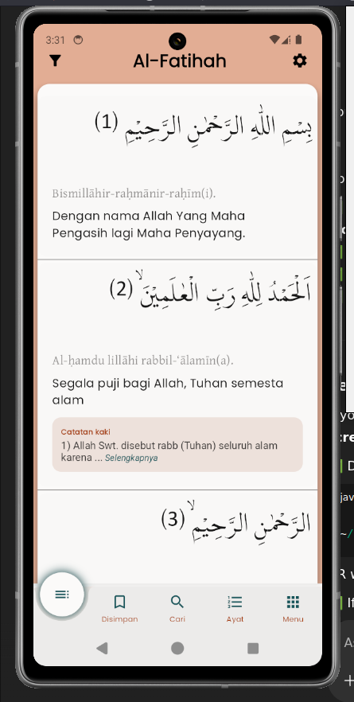

# FastiQuran – Free · No Ads · Cross-Platform. Just Quran for You

**FastiQuran** is a fast, lightweight, and customizable Quran app built for a distraction-free experience. It's completely **free**, **ad-free**, and available **across platforms** — so you can focus on the Quran, anytime, anywhere.

No subscriptions. No pop-ups. No compromises. Just Quran, made for you.

## 

## 🌟 Welcome to FastiQuran

FastiQuran isn't just a Quran app—it's your spiritual companion. Designed for simplicity and depth, it helps you connect with the Quran effortlessly. Whether you're reading, memorizing, or reflecting, FastiQuran supports every step of your journey.

## 📱 Download FastiQuran

FastiQuran is available across all major platforms:

| Platform       | Download                                                                             | Requirements  |
| -------------- | ------------------------------------------------------------------------------------ | ------------- |
| 🖥️ **Windows** | [Download](https://flagodna-developer.github.io/fastiquran/download/windows)         | Windows 10+   |
| 🍎 **macOS**   | On-progress                                                                          | macOS 10.15+  |
| 🐧 **Linux**   | [Download](https://flagodna-developer.github.io/fastiquran/download/linux)           | Ubuntu 18.04+ |
| 📱 **Android** | [Google Play](https://play.google.com/store/apps/details?id=com.flagodna.fastiquran) | Android 6.0+  |
| 🍎 **iOS**     | On-progress                                                                          | iOS 12.0+     |

## ✨ Why You'll Love It

### 🔖 **Bookmarks**

Save your favorite verses and passages for quick access. Never lose track of meaningful moments in your reading.

### 🔍 **Advanced Search**

Find any verse, topic, or keyword instantly with our powerful search engine. Search in Arabic, transliteration, or translation.

### 🧠 **Memorization**

Built-in tools to help you memorize the Quran with spaced repetition, progress tracking, and personalized review schedules.

### 📿 **Dhikr & Duas**

Access a comprehensive collection of authentic dhikr and duas for daily spiritual practice.

### 📚 **Learning**

Interactive features to enhance your understanding with tafsir, word-by-word translation, and pronunciation guides.

### 🧭 **Qibla Finder**

Always know the direction of prayer with our accurate Qibla compass, working anywhere in the world.

### 🎨 **Custom Themes**

Personalize your reading experience with beautiful themes and customizable fonts for optimal comfort.

### ⚙️ **Flexible Settings**

Tailor the app to your preferences with extensive customization options for reading, audio, and interface.

### 📱 **Multi-Device Sync**

Seamlessly sync your progress, bookmarks, and settings across all your devices.

### 🚫 **No Ads**

Enjoy a pure, distraction-free spiritual experience without any advertisements.

## ❤️ Our Mission

- 🕌 **To create a serene, distraction-free space for the Quran**
- 📖 **To help you build meaningful daily Quran habits**
- ⚡ **To combine powerful tools with simplicity**
- 🌍 **To serve the global Muslim community with care**

## 🚀 Getting Started

1. **Download** the app for your platform from the table above
2. **Install** following your system's standard installation process
3. **Launch** FastiQuran and begin your spiritual journey
4. **Explore** the features and customize to your preferences

## 📸 Screenshots

## 🔗 Explore More

| Link                                                                                        | Description                      |
| ------------------------------------------------------------------------------------------- | -------------------------------- |
| [⭐ Rate the App](https://your-app-store-link.com)                                          | Your feedback helps us grow      |
| [🌐 Official Website](https://flagodna-developer.github.io/fastiquran/)                     | Discover more about our vision   |
| [💻 GitHub Project](https://github.com/Flagodna-Developer/fastiquran)                       | See how it's built               |
| [🤝 Contribute](https://github.com/Flagodna-Developer/fastiquran/blob/main/CONTRIBUTING.md) | Help improve FastiQuran          |
| [📱 Get on Other Devices](https://flagodna-developer.github.io/fastiquran/download/)        | Available everywhere you need it |

## 🙌 Behind FastiQuran

**Creator & Maintainer**: [Cahyanudien AS](https://github.com/cas8398)

## 🆘 Support & Feedback

Need help or want to share feedback?

- 📧 **Email**: fastiquran@outlook.com
- 🐛 **Bug Reports**: [GitHub Issues](https://github.com/Flagodna-Developer/fastiquran/issues)

## 🙏 Acknowledgments

Special thanks to all users who have provided feedback and helped make FastiQuran better for the entire Muslim community.

---

**Crafted with ❤️ for the Muslim Ummah**

_"And We have certainly made the Quran easy for remembrance, so is there any who will remember?" - Quran 54:17_
